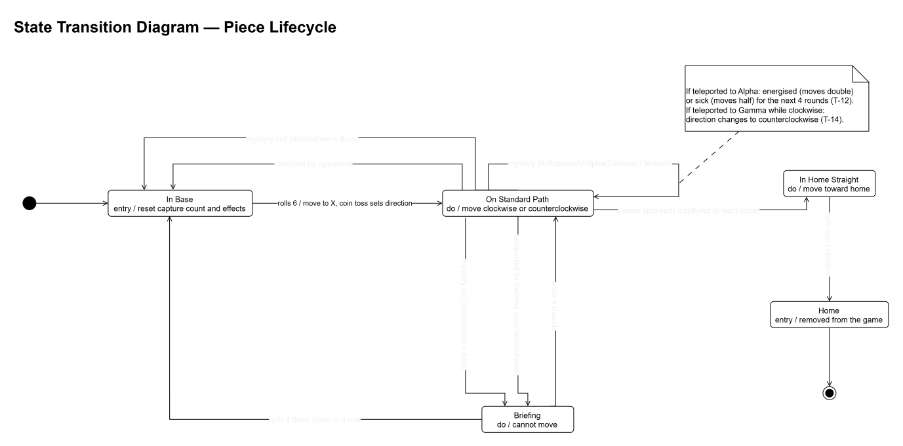
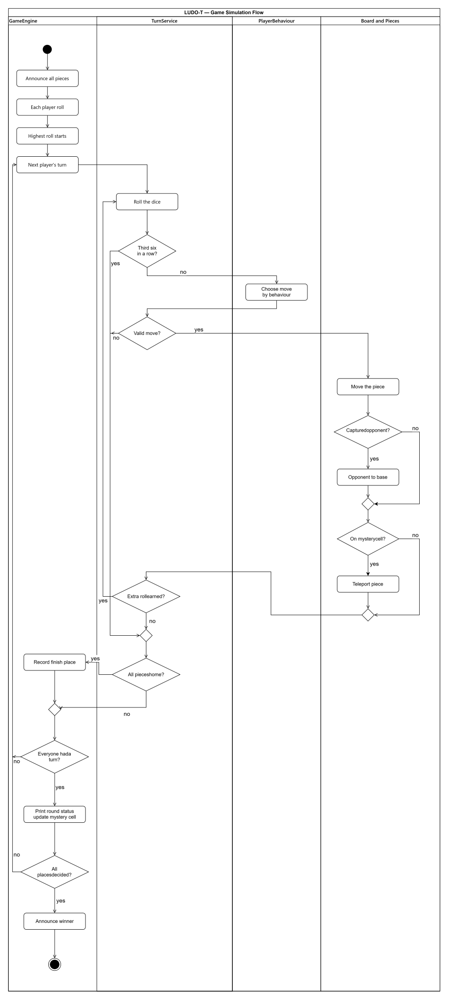
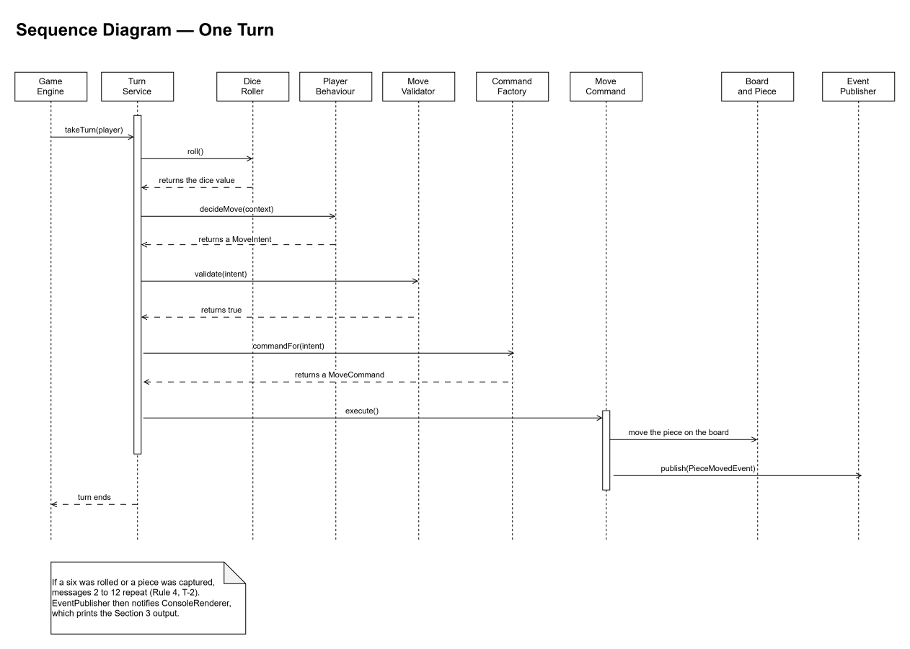

# LUDO-T Simulation — Design Diagrams

COMP63038 Clean Coding and Concurrent Programming — Assignment 1

All diagrams are provided as SVG so they stay sharp at any zoom level. Each one also has a PNG version and an editable `.drawio` source file in the `diagrams` folder.

## Class Diagram

Click the image to open it at full size. Use Ctrl + scroll to zoom.

## State Transition Diagram — Piece Lifecycle

Click the image to open it at full size.

## Activity Diagram — Game Simulation Flow

Click the image to open it at full size.

## Sequence Diagram — One Turn

Click the image to open it at full size.

## Files

| Diagram | SVG | PNG | Source |
|---|---|---|---|
| Class | `diagrams/class-diagram.svg` | `diagrams/class-diagram.png` | `diagrams/class-diagram.drawio` |
| State transition | `diagrams/state-diagram.svg` | `diagrams/state-diagram.png` | `diagrams/state-diagram.drawio` |
| Activity | `diagrams/activity-diagram.svg` | `diagrams/activity-diagram.png` | `diagrams/activity-diagram.drawio` |
| Sequence | `diagrams/sequence-diagram.svg` | `diagrams/sequence-diagram.png` | `diagrams/sequence-diagram.drawio` |
